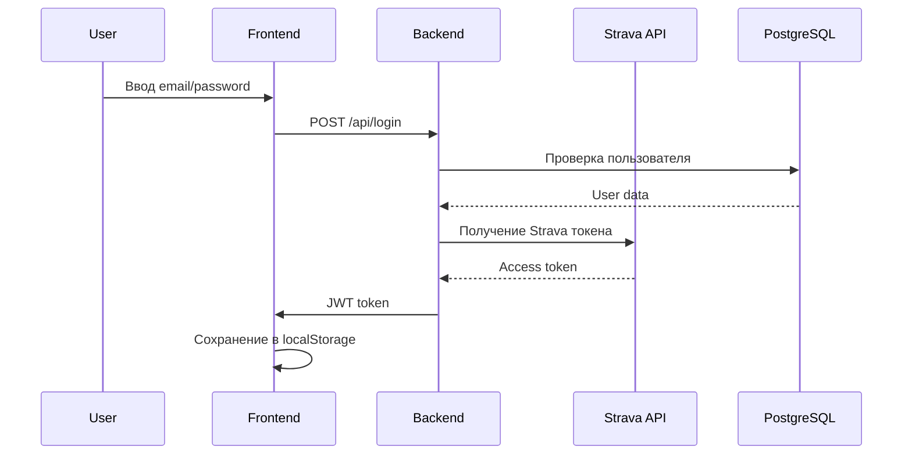
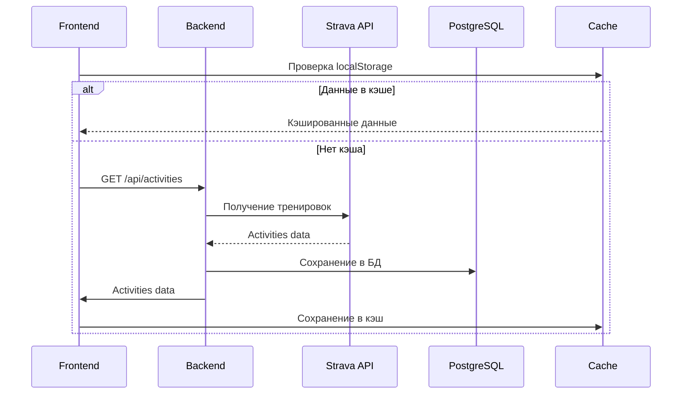
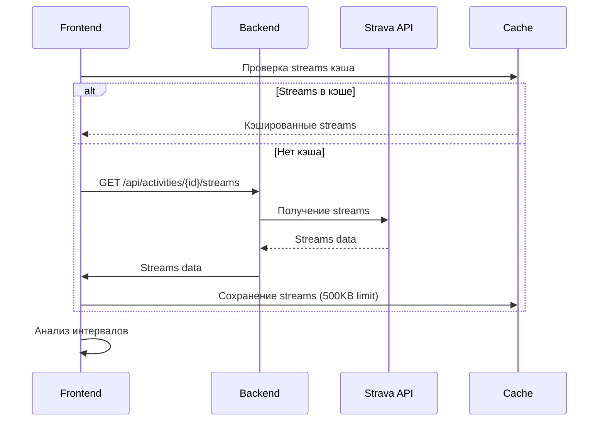
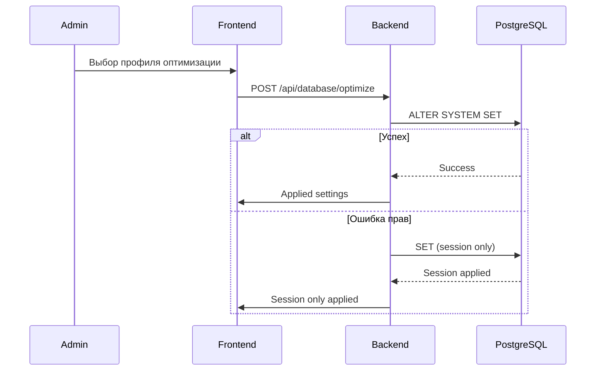

# 🏗️ Архитектура CycleProg

## 📋 Содержание

1. [Обзор архитектуры](#обзор-архитектуры)
2. [Компоненты системы](#компоненты-системы)
3. [Потоки данных](#потоки-данных)
4. [Система кэширования](#система-кэширования)
5. [База данных](#база-данных)
6. [API эндпоинты](#api-эндпоинты)
7. [Безопасность](#безопасность)
8. [Мониторинг](#мониторинг)
9. [Развертывание](#развертывание)

---

## 🎯 Обзор архитектуры

```
┌─────────────────┐    ┌─────────────────┐    ┌─────────────────┐
│   Frontend      │    │    Backend      │    │   External      │
│   (React SPA)   │◄──►│   (Node.js)     │◄──►│   APIs          │
│                 │    │                 │    │                 │
│ • localStorage  │    │ • PostgreSQL    │    │ • Strava API    │
│ • Session Mgmt  │    │ • Redis Cache   │    │ • Weather API   │
│ • UI Components │    │ • File Storage  │    │ • Maps API      │
└─────────────────┘    └─────────────────┘    └─────────────────┘
```

### **Технологический стек:**

#### **Frontend:**
- **React 18** - UI фреймворк
- **Vite** - сборщик и dev сервер
- **Recharts** - графики и диаграммы
- **CSS3** - стилизация

#### **Backend:**
- **Node.js** - серверная платформа
- **Express.js** - веб-фреймворк
- **PostgreSQL** - основная БД
- **JWT** - аутентификация

#### **External APIs:**
- **Strava API** - данные о тренировках
- **Open-Meteo** - погодные данные
- **Google Maps** - карты и геолокация

---

## 🧩 Компоненты системы

### **Frontend (React SPA)**

#### **Структура папок:**
```
react-spa/src/
├── components/          # Переиспользуемые компоненты
│   ├── charts/         # Графики и диаграммы
│   ├── ui/             # UI компоненты
│   └── blocks/         # Блоки страниц
├── pages/              # Страницы приложения
├── utils/              # Утилиты и хелперы
├── assets/             # Статические ресурсы
└── styles/             # CSS файлы
```

#### **Ключевые компоненты:**
- **`PlanPage`** - главная страница с аналитикой
- **`TrainingsPage`** - список тренировок
- **`GaragePage`** - гараж велосипедов
- **`AdminPage`** - административная панель
- **`DatabaseMemoryInfo`** - мониторинг БД

### **Backend (Node.js)**

#### **Структура папок:**
```
server/
├── server.js           # Основной сервер
├── database_profiles.js # Профили оптимизации PostgreSQL
├── apply_profile.js    # Скрипт применения профилей
├── aiAnalysis.js       # AI анализ тренировок
├── public/             # Статические файлы
└── strava_tokens.json  # Токены Strava
```

#### **Ключевые модули:**
- **Express сервер** - обработка HTTP запросов
- **PostgreSQL Pool** - управление соединениями с БД
- **JWT Middleware** - аутентификация
- **Strava Integration** - интеграция с Strava API

---

## 🔄 Потоки данных

### **1. Аутентификация пользователя**



### **2. Загрузка тренировок**



### **3. Анализ интервалов**



### **4. Оптимизация PostgreSQL**



---

## 💾 Система кэширования

### **3-уровневая архитектура кэширования:**

```
┌─────────────────┐    ┌─────────────────┐    ┌─────────────────┐
│   Frontend      │    │    Backend      │    │   PostgreSQL    │
│  localStorage   │◄──►│   In-Memory     │◄──►│   Shared        │
│   (30 мин TTL)  │    │     Cache       │    │   Buffers       │
└─────────────────┘    └─────────────────┘    └─────────────────┘
```

### **Frontend кэширование (localStorage):**

#### **Кэшируемые данные:**
```javascript
// Ключи кэша
const CACHE_KEYS = {
  ACTIVITIES: 'activities',           // Тренировки (30 мин)
  GARAGE_IMAGES: 'garage_images',     // Изображения гаража (1 час)
  WEATHER_DATA: 'weather_data',       // Погодные данные (30 мин)
  HERO_IMAGES: 'hero_images',         // Hero изображения (5 мин)
  STREAMS: 'streams_${activityId}'    // Данные потоков (7 дней, 500KB)
};
```

#### **Управление кэшем:**
```javascript
// Автоматическая очистка
cleanupOldStreamsCache() // Удаляет streams старше 7 дней

// TTL (Time To Live)
const DEFAULT_TTL = 30 * 60 * 1000; // 30 минут

// Ограничения размера
const STREAMS_SIZE_LIMIT = 500000; // 500KB для streams
```

### **Backend кэширование:**

#### **In-Memory кэш:**
- **Hero изображения** - 5 минут TTL
- **Аналитика** - кэшируется на уровне запросов
- **Strava токены** - обновляются автоматически

#### **PostgreSQL кэш:**
- **Shared buffers** - настраиваемый размер
- **Effective cache size** - планировщик запросов
- **Work memory** - память на операции

---

## 🗄️ База данных

### **PostgreSQL конфигурация:**

#### **Подключение:**
```javascript
const pool = new Pool({
  host: process.env.PGHOST,
  user: process.env.PGUSER,
  password: process.env.PGPASSWORD,
  database: process.env.PGDATABASE,
  port: process.env.PGPORT,
  ssl: isProduction ? { rejectUnauthorized: false } : false
});
```

#### **Основные таблицы:**
```sql
-- Пользователи
users (id, email, password_hash, strava_id, created_at)

-- Тренировки
activities (id, user_id, strava_id, name, distance, duration, ...)

-- Ручные тренировки
rides (id, user_id, title, location, details, start, created_at)

-- Чеклист
checklist (id, user_id, section, item, checked, created_at)

-- Персональные цели
goals (id, user_id, title, description, target_value, current_value, unit, goal_type, period, created_at, updated_at)

-- Токены Strava
strava_tokens (user_id, access_token, refresh_token, expires_at)

-- Настройки приложения
settings (key, value, updated_at)
```

### **Профили оптимизации:**

#### **Доступные профили:**
| Профиль | RAM | Max Connections | Описание |
|---------|-----|-----------------|----------|
| `low-end` | 256 MB | 10 | Очень ограниченные ресурсы |
| `medium` | 1 GB | 50 | Средние ресурсы |
| `high-end` | 4 GB | 200 | Мощный сервер |
| `enterprise` | 16 GB | 500 | Корпоративный сервер |

#### **Ключевые настройки:**
```sql
-- Low-end профиль (256 MB RAM)
shared_buffers: 16MB              -- 6% от RAM
effective_cache_size: 128MB       -- 50% от RAM
work_mem: 512kB                   -- Память на операцию
maintenance_work_mem: 2MB         -- Память для обслуживания
max_connections: 10               -- Максимум соединений
```

---

## 🔌 API эндпоинты

### **Аутентификация:**
```
POST   /api/login                 # Вход пользователя
POST   /api/register              # Регистрация
GET    /api/auth/verify           # Проверка токена
```

### **Тренировки:**
```
GET    /api/activities            # Список тренировок
GET    /api/activities/:id        # Детали тренировки
GET    /api/activities/:id/streams # Данные потоков
POST   /api/activities            # Создание тренировки
PUT    /api/activities/:id        # Обновление тренировки
DELETE /api/activities/:id        # Удаление тренировки
```

### **Аналитика:**
```
GET    /api/analytics/summary     # Общая аналитика
GET    /api/analytics/intervals   # Анализ интервалов
GET    /api/analytics/vo2max      # VO2max данные
```

### **Администрирование:**
```
GET    /api/admin/rides           # Управление тренировками
GET    /api/admin/garage          # Управление гаражом
GET    /api/admin/hero            # Управление hero изображениями
GET    /api/admin/tokens          # Токены Strava
```

### **База данных:**
```
GET    /api/database/memory       # Информация о памяти
GET    /api/database/table-stats  # Статистика таблиц
GET    /api/database/profiles     # Профили оптимизации
POST   /api/database/optimize     # Применение оптимизации
POST   /api/database/clear-cache  # Очистка кэша
```

### **Внешние API:**
```
GET    /api/strava/activities     # Прокси к Strava API
GET    /api/weather               # Погодные данные
GET    /api/maps/geocode          # Геокодирование
```

---

## 🔒 Безопасность

### **Аутентификация:**
- **JWT токены** - для API аутентификации
- **Session storage** - для временных сессий
- **LocalStorage** - для постоянных сессий
- **Strava OAuth** - для интеграции с Strava

### **Авторизация:**
```javascript
// Middleware для проверки прав
const authMiddleware = (req, res, next) => {
  const token = req.headers.authorization?.split(' ')[1];
  if (!token) return res.status(401).json({ error: 'No token' });
  
  try {
    const decoded = jwt.verify(token, process.env.JWT_SECRET);
    req.user = decoded;
    next();
  } catch (error) {
    res.status(401).json({ error: 'Invalid token' });
  }
};
```

### **Защита данных:**
- **HTTPS** - шифрование трафика
- **SQL Injection** - параметризованные запросы
- **XSS** - санитизация данных
- **CSRF** - токены для форм

### **Переменные окружения:**
```bash
# База данных
PGHOST=localhost
PGUSER=postgres
PGPASSWORD=your_password
PGDATABASE=cycleprog
PGPORT=5432

# JWT
JWT_SECRET=your_jwt_secret

# Strava
STRAVA_CLIENT_ID=your_client_id
STRAVA_CLIENT_SECRET=your_client_secret

# Внешние API
WEATHER_API_KEY=your_weather_api_key
MAPS_API_KEY=your_maps_api_key
```

---

## 📊 Мониторинг

### **Frontend мониторинг:**
- **CacheStatus** - статус кэша в реальном времени
- **Error boundaries** - обработка ошибок React
- **Performance monitoring** - метрики производительности

### **Backend мониторинг:**
- **DatabaseMemoryInfo** - мониторинг PostgreSQL
- **API rate limiting** - ограничение запросов
- **Error logging** - логирование ошибок

### **Метрики производительности:**
```javascript
// Кэш hit ratio
const cacheHitRatio = (hits / (hits + misses)) * 100;

// Время ответа API
const responseTime = Date.now() - startTime;

// Использование памяти
const memoryUsage = process.memoryUsage();
```

### **Логирование:**
```javascript
// Структурированные логи
console.log({
  level: 'info',
  message: 'API request processed',
  endpoint: req.path,
  method: req.method,
  responseTime: Date.now() - startTime,
  userAgent: req.headers['user-agent']
});
```

---

## 🚀 Развертывание

### **Требования к серверу:**

#### **Минимальные:**
- **RAM:** 256 MB
- **CPU:** 0.1 vCPU
- **Storage:** 1 GB
- **OS:** Linux (Ubuntu/Debian)

#### **Рекомендуемые:**
- **RAM:** 1 GB+
- **CPU:** 1 vCPU+
- **Storage:** 10 GB+
- **OS:** Ubuntu 20.04+

### **Установка:**

#### **1. Клонирование репозитория:**
```bash
git clone https://github.com/your-username/cycleprog.github.io.git
cd cycleprog.github.io
```

#### **2. Установка зависимостей:**
```bash
# Frontend
cd react-spa
npm install
npm run build

# Backend
cd ../server
npm install
```

#### **3. Настройка базы данных:**
```bash
# Создание базы данных
sudo -u postgres createdb cycleprog

# Применение миграций
psql -d cycleprog -f migrations/init.sql

# Оптимизация PostgreSQL
sudo -u postgres node apply_profile.js low-end
sudo systemctl restart postgresql
```

#### **4. Настройка переменных окружения:**
```bash
# Создание .env файла
cp .env.example .env
nano .env

# Заполнение переменных
PGHOST=localhost
PGUSER=postgres
PGPASSWORD=your_password
PGDATABASE=cycleprog
JWT_SECRET=your_secret_key
STRAVA_CLIENT_ID=your_strava_client_id
STRAVA_CLIENT_SECRET=your_strava_client_secret
```

#### **5. Запуск приложения:**
```bash
# Development
npm run dev

# Production
npm start
```

### **Nginx конфигурация:**
```nginx
server {
    listen 80;
    server_name your-domain.com;

    # Frontend
    location / {
        root /path/to/react-spa/dist;
        try_files $uri $uri/ /index.html;
    }

    # Backend API
    location /api {
        proxy_pass http://localhost:8080;
        proxy_http_version 1.1;
        proxy_set_header Upgrade $http_upgrade;
        proxy_set_header Connection 'upgrade';
        proxy_set_header Host $host;
        proxy_cache_bypass $http_upgrade;
    }

    # Статические файлы
    location /img {
        alias /path/to/public/img;
        expires 1y;
        add_header Cache-Control "public, immutable";
    }
}
```

### **SSL сертификат:**
```bash
# Установка Certbot
sudo apt install certbot python3-certbot-nginx

# Получение сертификата
sudo certbot --nginx -d your-domain.com

# Автоматическое обновление
sudo crontab -e
# Добавить: 0 12 * * * /usr/bin/certbot renew --quiet
```

---

## 🔧 Обслуживание

### **Ежедневные задачи:**
- **Мониторинг логов** - проверка ошибок
- **Очистка кэша** - удаление старых данных
- **Бэкап базы данных** - резервное копирование

### **Еженедельные задачи:**
- **Анализ производительности** - метрики и оптимизация
- **Обновление зависимостей** - npm audit и обновления
- **Проверка безопасности** - сканирование уязвимостей

### **Ежемесячные задачи:**
- **Обзор архитектуры** - планирование улучшений
- **Мониторинг ресурсов** - использование CPU/RAM/Storage
- **Обновление документации** - актуализация

---

## 📚 Дополнительные ресурсы

### **Документация:**
- [PostgreSQL Optimization Guide](server/POSTGRES_OPTIMIZATION.md)
- [API Documentation](API.md)
- [Deployment Guide](DEPLOYMENT.md)

### **Полезные команды:**
```bash
# Мониторинг PostgreSQL
psql -c "SELECT name, setting, unit FROM pg_settings WHERE name IN ('shared_buffers', 'effective_cache_size', 'work_mem');"

# Очистка кэша
curl -X POST http://localhost:8080/api/database/clear-cache

# Применение профиля
sudo -u postgres node apply_profile.js low-end

# Бэкап базы данных
pg_dump cycleprog > backup_$(date +%Y%m%d).sql
```

---

*Документация обновлена: $(date)* 