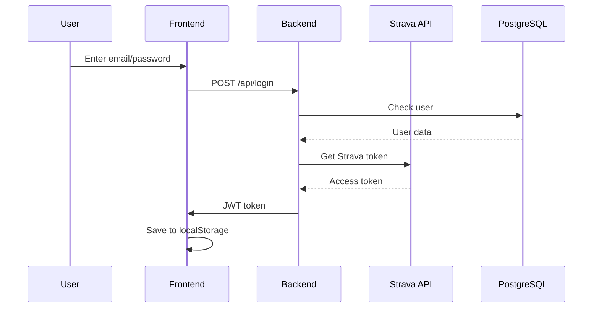
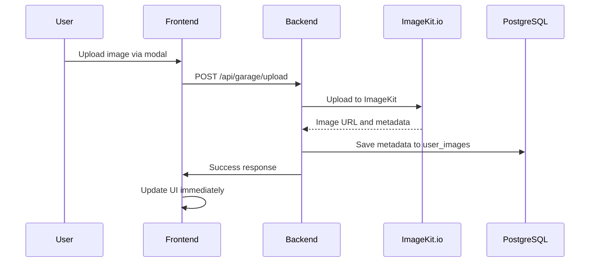
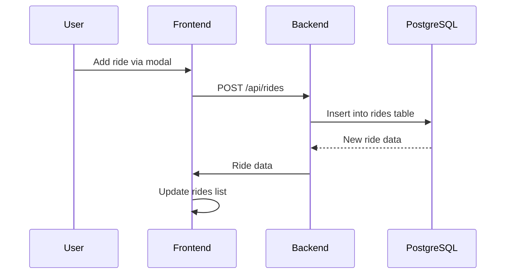
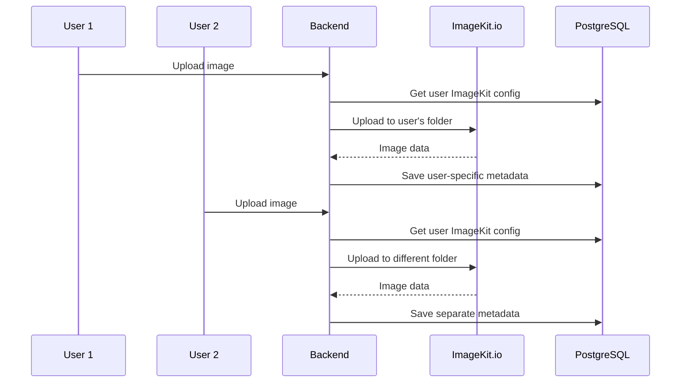

# 🏗️ CycleProg Architecture

## 📋 Table of Contents

1. [Architecture Overview](#architecture-overview)
2. [System Components](#system-components)
3. [Data Flow](#data-flow)
4. [Caching System](#caching-system)
5. [Database](#database)
6. [API Endpoints](#api-endpoints)
7. [Security](#security)
8. [Monitoring](#monitoring)
9. [Deployment](#deployment)

---

## 🎯 Architecture Overview

```
┌─────────────────┐    ┌─────────────────┐    ┌─────────────────┐
│   Frontend      │    │    Backend      │    │   External      │
│   (React SPA)   │◄──►│   (Node.js)     │◄──►│   APIs          │
│                 │    │                 │    │                 │
│ • localStorage  │    │ • PostgreSQL    │    │ • Strava API    │
│ • Session Mgmt  │    │ • ImageKit.io   │    │ • Weather API   │
│ • UI Components │    │ • File Storage  │    │ • Maps API      │
└─────────────────┘    └─────────────────┘    └─────────────────┘
```

### **Technology Stack:**

#### **Frontend:**
- **React 18** - UI framework
- **Vite** - build tool and dev server
- **Recharts** - charts and diagrams
- **CSS3** - styling

#### **Backend:**
- **Node.js** - server platform
- **Express.js** - web framework
- **PostgreSQL** - main database
- **JWT** - authentication
- **ImageKit.io** - image hosting and optimization

#### **External APIs:**
- **Strava API** - workout data
- **Open-Meteo** - weather data
- **Google Maps** - maps and geolocation
- **ImageKit.io** - image CDN with WebP optimization

---

## 🧩 System Components

### **Frontend (React SPA)**

#### **Folder Structure:**
```
react-spa/src/
├── components/          # Reusable components
│   ├── charts/         # Charts and diagrams
│   ├── ui/             # UI components
│   ├── modals/         # Modal windows
│   └── blocks/         # Page blocks
├── pages/              # Application pages
├── utils/              # Utilities and helpers
├── assets/             # Static resources
└── styles/             # CSS files
```

#### **Key Components:**
- **`PlanPage`** - main page with analytics
- **`TrainingsPage`** - workout list
- **`GaragePage`** - bike garage with image upload
- **`AdminPage`** - administrative panel
- **`ImageUploadModal`** - image upload modal
- **`RideAddModal`** - ride addition modal
- **`DatabaseMemoryInfo`** - database monitoring

### **Backend (Node.js)**

#### **Folder Structure:**
```
server/
├── server.js           # Main server
├── imagekit-config.js  # ImageKit configuration
├── database_profiles.js # PostgreSQL optimization profiles
├── apply_profile.js    # Profile application script
├── aiAnalysis.js       # AI workout analysis
├── public/             # Static files
└── strava_tokens.json  # Strava tokens
```

#### **Key Modules:**
- **Express server** - HTTP request handling
- **PostgreSQL Pool** - database connection management
- **JWT Middleware** - authentication
- **Strava Integration** - Strava API integration
- **ImageKit Integration** - image hosting and management

---

## 🔄 Data Flow

### **1. User Authentication**



### **2. Image Upload Flow**



### **3. Ride Addition Flow**



### **4. Multi-User ImageKit System**



---

## 💾 Caching System

### **3-Level Caching Architecture:**

```
┌─────────────────┐    ┌─────────────────┐    ┌─────────────────┐
│   Frontend      │    │    Backend      │    │   PostgreSQL    │
│  localStorage   │◄──►│   In-Memory     │◄──►│   Shared        │
│   (30 min TTL)  │    │     Cache       │    │   Buffers       │
└─────────────────┘    └─────────────────┘    └─────────────────┘
```

### **Frontend Caching (localStorage):**

#### **Cached Data:**
```javascript
// Cache keys
const CACHE_KEYS = {
  ACTIVITIES: 'activities',           // Workouts (30 min)
  GARAGE_IMAGES: 'garage_images',     // Garage images (1 hour)
  WEATHER_DATA: 'weather_data',       // Weather data (30 min)
  HERO_IMAGES: 'hero_images',         // Hero images (5 min)
  STREAMS: 'streams_${activityId}'    // Stream data (7 days, 500KB)
};
```

#### **Cache Management:**
```javascript
// Automatic cleanup
cleanupOldStreamsCache() // Remove streams older than 7 days

// TTL (Time To Live)
const DEFAULT_TTL = 30 * 60 * 1000; // 30 minutes

// Size limits
const STREAMS_SIZE_LIMIT = 500000; // 500KB for streams
```

### **Backend Caching:**

#### **In-Memory Cache:**
- **Hero images** - 5 minutes TTL
- **Analytics** - cached at request level
- **Strava tokens** - auto-refreshed

#### **PostgreSQL Cache:**
- **Shared buffers** - configurable size
- **Effective cache size** - query planner
- **Work memory** - operation memory

---

## 🗄️ Database

### **PostgreSQL Configuration:**

#### **Connection:**
```javascript
const pool = new Pool({
  host: process.env.PGHOST,
  user: process.env.PGUSER,
  password: process.env.PGPASSWORD,
  database: process.env.PGDATABASE,
  port: process.env.PGPORT,
  ssl: isProduction ? { rejectUnauthorized: false } : false
});
```

#### **Main Tables:**
```sql
-- Users
users (id, email, password_hash, strava_id, created_at)

-- Workouts
activities (id, user_id, strava_id, name, distance, duration, ...)

-- Manual rides
rides (id, user_id, title, location, details, start, created_at)

-- Checklist
checklist (id, user_id, section, item, checked, link, created_at)

-- Personal goals
goals (id, user_id, title, description, target_value, current_value, unit, goal_type, period, created_at, updated_at)

-- Strava tokens
strava_tokens (user_id, access_token, refresh_token, expires_at)

-- User images (ImageKit integration)
user_images (id, user_id, image_type, position, file_id, file_url, file_path, file_name, original_name)

-- Application settings
settings (key, value, updated_at)
```

### **ImageKit Integration Tables:**

```sql
-- User ImageKit configurations (deprecated - now using env variables)
-- user_imagekit_config (id, user_id, public_key, private_key, url_endpoint, is_active)

-- User images metadata
user_images (
  id SERIAL PRIMARY KEY,
  user_id INTEGER REFERENCES users(id),
  image_type VARCHAR(50),      -- 'garage', 'hero', 'general'
  position VARCHAR(50),        -- 'right', 'left-top', 'left-bottom'
  file_id VARCHAR(255),        -- ImageKit file ID
  file_url TEXT,               -- ImageKit URL with WebP transformations
  file_path VARCHAR(500),      -- ImageKit file path
  file_name VARCHAR(255),      -- ImageKit file name
  original_name VARCHAR(255)   -- Original file name
);
```

**ImageKit Features:**
- **Automatic WebP conversion** - all images converted to WebP format
- **100% quality preservation** - no quality loss during conversion
- **CDN delivery** - fast global image delivery
- **Responsive transformations** - automatic format optimization

### **Optimization Profiles:**

#### **Available Profiles:**
| Profile | RAM | Max Connections | Description |
|---------|-----|-----------------|-------------|
| `low-end` | 256 MB | 10 | Very limited resources |
| `medium` | 1 GB | 50 | Medium resources |
| `high-end` | 4 GB | 200 | Powerful server |
| `enterprise` | 16 GB | 500 | Enterprise server |

#### **Key Settings:**
```sql
-- Low-end profile (256 MB RAM)
shared_buffers: 16MB              -- 6% of RAM
effective_cache_size: 128MB       -- 50% of RAM
work_mem: 512kB                   -- Memory per operation
maintenance_work_mem: 2MB         -- Maintenance memory
max_connections: 10               -- Max connections
```

---

## 🔌 API Endpoints

### **Authentication:**
```
POST   /api/login                 # User login
POST   /api/register              # Registration
GET    /api/auth/verify           # Token verification
```

### **Workouts:**
```
GET    /api/activities            # Workout list
GET    /api/activities/:id        # Workout details
GET    /api/activities/:id/streams # Stream data
POST   /api/activities            # Create workout
PUT    /api/activities/:id        # Update workout
DELETE /api/activities/:id        # Delete workout
```

### **Rides Management:**
```
GET    /api/rides                 # Get user rides
POST   /api/rides                 # Add new ride
PUT    /api/rides/:id             # Update ride
DELETE /api/rides/:id             # Delete ride
POST   /api/rides/import          # Import rides
```

### **Image Management (ImageKit):**
```
GET    /api/garage/positions      # Get garage images
POST   /api/garage/upload         # Upload image
DELETE /api/garage/images/:name   # Delete image
GET    /api/imagekit/config       # Get ImageKit config
```

### **Analytics:**
```
GET    /api/analytics/summary     # General analytics
GET    /api/analytics/intervals   # Interval analysis
GET    /api/analytics/vo2max      # VO2max data
```

### **Administration:**
```
GET    /api/admin/rides           # Ride management
GET    /api/admin/garage          # Garage management
GET    /api/admin/hero            # Hero image management
GET    /api/admin/tokens          # Strava tokens
```

### **Database:**
```
GET    /api/database/memory       # Memory information
GET    /api/database/table-stats  # Table statistics
GET    /api/database/profiles     # Optimization profiles
POST   /api/database/optimize     # Apply optimization
POST   /api/database/clear-cache  # Clear cache
```

### **External APIs:**
```
GET    /api/strava/activities     # Strava API proxy
GET    /api/strava/limits         # Strava rate limits
POST   /api/strava/limits/refresh # Refresh Strava limits
GET    /api/weather               # Weather data
GET    /api/maps/geocode          # Geocoding
```

---

## 🔒 Security

### **Authentication:**
- **JWT tokens** - for API authentication
- **Session storage** - for temporary sessions
- **LocalStorage** - for persistent sessions
- **Strava OAuth** - for Strava integration

### **Authorization:**
```javascript
// Middleware for permission checking
const authMiddleware = (req, res, next) => {
  const token = req.headers.authorization?.split(' ')[1];
  if (!token) return res.status(401).json({ error: 'No token' });
  
  try {
    const decoded = jwt.verify(token, process.env.JWT_SECRET);
    req.user = decoded;
    next();
  } catch (error) {
    res.status(401).json({ error: 'Invalid token' });
  }
};
```

### **Data Protection:**
- **HTTPS** - traffic encryption
- **SQL Injection** - parameterized queries
- **XSS** - data sanitization
- **CSRF** - form tokens

### **Environment Variables:**
```bash
# Database
PGHOST=localhost
PGUSER=postgres
PGPASSWORD=your_password
PGDATABASE=cycleprog
PGPORT=5432

# JWT
JWT_SECRET=your_jwt_secret

# Strava
STRAVA_CLIENT_ID=your_client_id
STRAVA_CLIENT_SECRET=your_client_secret

# ImageKit.io
IMAGEKIT_PUBLIC_KEY=your_public_key
IMAGEKIT_PRIVATE_KEY=your_private_key
IMAGEKIT_URL_ENDPOINT=https://ik.imagekit.io/your_account

# External APIs
WEATHER_API_KEY=your_weather_api_key
MAPS_API_KEY=your_maps_api_key
```

---

## 📊 Monitoring

### **Frontend Monitoring:**
- **CacheStatus** - real-time cache status
- **Error boundaries** - React error handling
- **Performance monitoring** - performance metrics

### **Backend Monitoring:**
- **DatabaseMemoryInfo** - PostgreSQL monitoring
- **API rate limiting** - request limiting
- **Error logging** - error logging

### **Performance Metrics:**
```javascript
// Cache hit ratio
const cacheHitRatio = (hits / (hits + misses)) * 100;

// API response time
const responseTime = Date.now() - startTime;

// Memory usage
const memoryUsage = process.memoryUsage();
```

### **Logging:**
```javascript
// Structured logs
console.log({
  level: 'info',
  message: 'API request processed',
  endpoint: req.path,
  method: req.method,
  responseTime: Date.now() - startTime,
  userAgent: req.headers['user-agent']
});
```

---

## 🚀 Deployment

### **Server Requirements:**

#### **Minimum:**
- **RAM:** 256 MB
- **CPU:** 0.1 vCPU
- **Storage:** 1 GB
- **OS:** Linux (Ubuntu/Debian)

#### **Recommended:**
- **RAM:** 1 GB+
- **CPU:** 1 vCPU+
- **Storage:** 10 GB+
- **OS:** Ubuntu 20.04+

### **Installation:**

#### **1. Repository Cloning:**
```bash
git clone https://github.com/your-username/cycleprog.github.io.git
cd cycleprog.github.io
```

#### **2. Dependencies Installation:**
```bash
# Frontend
cd react-spa
npm install
npm run build

# Backend
cd ../server
npm install
```

#### **3. Database Setup:**
```bash
# Database creation
sudo -u postgres createdb cycleprog

# Apply migrations
psql -d cycleprog -f migrations/init.sql

# Create ImageKit tables
psql -d cycleprog -c "CREATE TABLE user_images (id SERIAL PRIMARY KEY, user_id INTEGER REFERENCES users(id), image_type VARCHAR(50), position VARCHAR(50), file_id VARCHAR(255), file_url TEXT, file_path VARCHAR(500), file_name VARCHAR(255), original_name VARCHAR(255));"

# PostgreSQL optimization
sudo -u postgres node apply_profile.js low-end
sudo systemctl restart postgresql
```

#### **4. Environment Variables Setup:**
```bash
# Create .env file
cp .env.example .env
nano .env

# Fill variables
PGHOST=localhost
PGUSER=postgres
PGPASSWORD=your_password
PGDATABASE=cycleprog
JWT_SECRET=your_secret_key
STRAVA_CLIENT_ID=your_strava_client_id
STRAVA_CLIENT_SECRET=your_strava_client_secret
IMAGEKIT_PUBLIC_KEY=your_imagekit_public_key
IMAGEKIT_PRIVATE_KEY=your_imagekit_private_key
IMAGEKIT_URL_ENDPOINT=https://ik.imagekit.io/your_account
```

#### **5. Application Launch:**
```bash
# Development
npm run dev

# Production
npm start
```

### **Nginx Configuration:**
```nginx
server {
    listen 80;
    server_name your-domain.com;

    # Frontend
    location / {
        root /path/to/react-spa/dist;
        try_files $uri $uri/ /index.html;
    }

    # Backend API
    location /api {
        proxy_pass http://localhost:8080;
        proxy_http_version 1.1;
        proxy_set_header Upgrade $http_upgrade;
        proxy_set_header Connection 'upgrade';
        proxy_set_header Host $host;
        proxy_cache_bypass $http_upgrade;
    }

    # Static files
    location /img {
        alias /path/to/public/img;
        expires 1y;
        add_header Cache-Control "public, immutable";
    }
}
```

### **SSL Certificate:**
```bash
# Certbot installation
sudo apt install certbot python3-certbot-nginx

# Certificate acquisition
sudo certbot --nginx -d your-domain.com

# Automatic renewal
sudo crontab -e
# Add: 0 12 * * * /usr/bin/certbot renew --quiet
```

---

## 🔧 Maintenance

### **Daily Tasks:**
- **Log monitoring** - error checking
- **Cache cleanup** - old data removal
- **Database backup** - backup copying

### **Weekly Tasks:**
- **Performance analysis** - metrics and optimization
- **Dependency updates** - npm audit and updates
- **Security checks** - vulnerability scanning

### **Monthly Tasks:**
- **Architecture review** - improvement planning
- **Resource monitoring** - CPU/RAM/Storage usage
- **Documentation updates** - documentation actualization

---

## 📚 Additional Resources

### **Documentation:**
- [PostgreSQL Optimization Guide](server/POSTGRES_OPTIMIZATION.md)
- [API Documentation](API.md)
- [Deployment Guide](DEPLOYMENT.md)
- [ImageKit Setup Guide](server/IMAGEKIT_SETUP.md)

### **Useful Commands:**
```bash
# PostgreSQL monitoring
psql -c "SELECT name, setting, unit FROM pg_settings WHERE name IN ('shared_buffers', 'effective_cache_size', 'work_mem');"

# Cache clearing
curl -X POST http://localhost:8080/api/database/clear-cache

# Profile application
sudo -u postgres node apply_profile.js low-end

# Database backup
pg_dump cycleprog > backup_$(date +%Y%m%d).sql

# ImageKit table cleanup (if needed)
psql -d cycleprog -c "DROP TABLE IF EXISTS user_imagekit_config;"
```

---

## 🆕 Recent Updates

### **v2.0 - Multi-User ImageKit Integration:**
- ✅ **Multi-user image hosting** - each user has isolated ImageKit folders
- ✅ **Modal-based image upload** - drag & drop interface with preview
- ✅ **Modal-based ride addition** - inline ride creation form
- ✅ **English interface** - complete translation to English
- ✅ **Automatic ImageKit config** - uses env variables for all users
- ✅ **Image quality optimization** - 100% quality with WebP format conversion
- ✅ **Responsive design** - mobile-friendly modals and interfaces

### **Key Features Added:**
- **ImageUploadModal** - drag & drop image upload with preview
- **RideAddModal** - inline ride creation form with validation
- **Multi-user ImageKit** - isolated image storage per user
- **English localization** - complete interface translation
- **Enhanced UX** - hover effects, loading states, error handling

---

*Documentation updated: $(date)* 